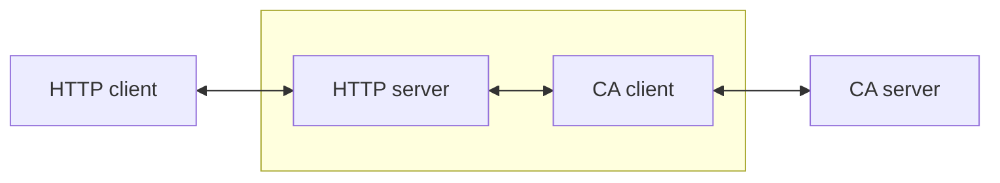

# Beemer

This project attempts to use an HTTP interface for communicating with a channel access (CA) server. The application is for an [EPICS](https://epics-controls.org) beamline network but it may be useful for other EPICS-based networks. The CA client and CA server components use the [caproto](https://github.com/caproto/caproto) package. The HTTP client uses the [httpx](https://www.python-httpx.org) package and the HTTP server uses the [fastapi](https://fastapi.tiangolo.com) package.

