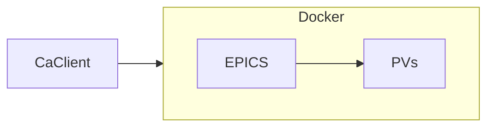

# Beemer

Beemer is a Python package for working with process variables (PVs) from EPICS input/output controllers (IOCs). The PVs are exposed via the channel access (CA) protocol using the included EPICS Docker container or caproto's CA server. Examples of each approach are provided in this repository.

## Installation

Use conda to create a Python environment where beemer is installed in editable (developer) mode.

```
conda env create --file environment.yml
conda activate beemer
```

## Examples

The examples demonstrate two approaches of using beemer to access PVs. One approach uses softIoc from an EPICS Docker container as shown in the diagram below. See the `epics-base/Dockerfile` to build the Docker image and container.



The other approach uses caproto's CA server for the PVs as shown below.


Both approaches can be implemented over HTTP using the `HttpClient` instead of the `CaClient`. See the comments in the examples for usage instructions.

## Further reading

See the links below for more information about EPICS and caproto.

- [EPICS GitHub](https://github.com/epics-base/epics-base)
- [EPICS website](https://epics-controls.org)
- [EPICS documentation](https://docs.epics-controls.org)
- [Caproto GitHub](https://github.com/caproto/caproto)
- [Caproto documentation](https://caproto.github.io/caproto/)
